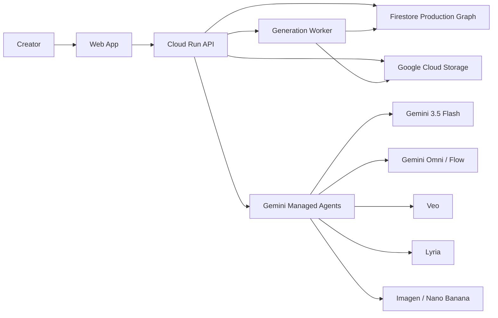

# Omnidesk Technical Spec

## System Overview

Omnidesk stores a project as a production graph. Agents read and update graph nodes, while media assets live in Google Cloud Storage.



## Recommended Stack

### Frontend

- Next.js or Vite React for fastest hackathon iteration.
- Tailwind or simple CSS modules.
- Firebase Auth optional; skip auth for demo if needed.

### Backend

- Node.js/TypeScript on Cloud Run.
- Firestore for structured project graph.
- GCS for uploads, generated media, storyboards, and exports.
- Cloud Tasks or simple worker queue for generation jobs.

### AI Layer

- Gemini 3.5 Flash for text/multimodal reasoning.
- Managed Agents in the Gemini API for orchestration.
- Omni/Flow for video generation/editing if available in the hackathon account.
- Veo for short generated scenes or fallback.
- Lyria for audio improvements and safe musical variants.
- Imagen/Nano Banana for keyframes/storyboards.

## Data Model

### Project

```ts
type Project = {
  id: string;
  title: string;
  ownerId: string;
  status: "draft" | "analyzing" | "storyboard" | "generating" | "ready" | "exported";
  targetFormat: "9:16" | "16:9" | "1:1";
  durationSeconds: number;
  createdAt: string;
  updatedAt: string;
  activeVersionId: string;
};
```

### Asset

```ts
type Asset = {
  id: string;
  projectId: string;
  kind: "audio" | "lyrics" | "dance_video" | "image" | "reference_video" | "generated_video" | "generated_image" | "export";
  gcsUri: string;
  mimeType: string;
  source: "user_uploaded" | "generated" | "licensed_demo" | "system";
  rightsStatus: "claimed_owned" | "licensed" | "generated" | "needs_review" | "rejected";
  consentStatus?: "self" | "permission_granted" | "unknown";
  metadata?: Record<string, unknown>;
};
```

### ProductionVersion

```ts
type ProductionVersion = {
  id: string;
  projectId: string;
  parentVersionId?: string;
  name: string;
  remixPrompt?: string;
  createdAt: string;
  changedScenes: string[];
};
```

### MusicAnalysis

```ts
type MusicAnalysis = {
  projectId: string;
  versionId: string;
  bpm?: number;
  sections: Array<{
    id: string;
    label: "intro" | "verse" | "pre_chorus" | "chorus" | "bridge" | "outro" | "drop" | "other";
    startSec: number;
    endSec: number;
    mood: string;
    energy: number;
    notes: string;
  }>;
  lyricAnchors: Array<{
    timestampSec?: number;
    lyric: string;
    visualOpportunity: string;
  }>;
};
```

### StyleBible

```ts
type StyleBible = {
  projectId: string;
  versionId: string;
  logline: string;
  visualLanguage: string;
  palette: string[];
  cameraLanguage: string[];
  wardrobeRules: string[];
  locationRules: string[];
  movementRules: string[];
  motifs: string[];
  negativeConstraints: string[];
};
```

### Scene

```ts
type Scene = {
  id: string;
  projectId: string;
  versionId: string;
  sectionId: string;
  startSec: number;
  endSec: number;
  title: string;
  description: string;
  locked: boolean;
  sourceAssetIds: string[];
  promptId?: string;
  generatedAssetIds: string[];
  safetyStatus: "pass" | "warn" | "blocked";
};
```

### GenerationPrompt

```ts
type GenerationPrompt = {
  id: string;
  projectId: string;
  versionId: string;
  sceneId: string;
  targetModel: "omni" | "veo" | "imagen" | "nano_banana" | "placeholder";
  prompt: string;
  negativePrompt: string;
  continuityRefs: string[];
  aspectRatio: "9:16" | "16:9" | "1:1";
  durationSeconds?: number;
};
```

### SafetyReport

```ts
type SafetyReport = {
  id: string;
  projectId: string;
  versionId: string;
  status: "pass" | "warn" | "blocked";
  ipRisks: string[];
  likenessRisks: string[];
  musicRightsRisks: string[];
  rewrittenTerms: Array<{ original: string; replacement: string; reason: string }>;
  originalityScore: number;
  recommendations: string[];
};
```

## Agent Contracts

### Music Analyst Agent

Input: audio asset, lyrics, target duration.

Output: `MusicAnalysis`.

Responsibilities:

- Detect sections and energy curve.
- Identify chorus/drop moments.
- Extract lyric anchors.
- Suggest cut points.

### Creator DNA Agent

Input: user-owned visual assets.

Output: creator DNA summary used by `StyleBible`.

Responsibilities:

- Extract movement language, outfits, color palette, locations, motifs.
- Avoid identity claims beyond user-provided consent.

### Creative Director Agent

Input: brief, music analysis, creator DNA, constraints.

Output: `StyleBible`.

Responsibilities:

- Convert brief into an original world.
- Preserve user-specific assets.
- Create a concise visual system.

### IP Safety Agent

Input: brief, references, style bible, prompts.

Output: `SafetyReport`, rewritten constraints.

Responsibilities:

- Detect protected franchise, artist, character, logo, and lookalike risk.
- Replace risky terms with original descriptive language.
- Block unsafe likeness requests.

### Scene Planner Agent

Input: music analysis, style bible, output duration.

Output: `Scene[]`.

Responsibilities:

- Map sections to scenes.
- Prioritize chorus/drop scenes.
- Create enough variety without losing continuity.

### Continuity Agent

Input: scenes, style bible, generated outputs.

Output: updated continuity notes and warnings.

Responsibilities:

- Keep wardrobe, character, environment, palette, and motifs consistent.
- Flag scene drift.

### Prompt Engineer Agent

Input: scene, style bible, continuity rules, safety report.

Output: `GenerationPrompt`.

Responsibilities:

- Produce model-specific prompts.
- Include negative prompts.
- Reference source assets and locked continuity details.

### Generation Router Agent

Input: prompt, available model capabilities, latency budget.

Output: generation job.

Responsibilities:

- Route to Omni/Flow where available.
- Use Veo for video clip fallback.
- Use Imagen/Nano Banana for keyframes if video is unavailable.
- Generate placeholders when API access is blocked.

### Audio Agent

Input: audio, music analysis, user request.

Output: safe audio edit plan or generated audio asset.

Responsibilities:

- Create intro/outro extensions, stingers, alternate sections, or transition beds.
- Avoid "sound like artist X" requests.
- Preserve user rights status.

### Editor Agent

Input: scenes, generated assets, music analysis.

Output: timeline JSON and preview manifest.

Responsibilities:

- Arrange clips to beat markers.
- Add transitions and caption markers.
- Produce export instructions.

### Remix Agent

Input: existing version, remix prompt.

Output: child `ProductionVersion`, changed scenes, updated prompts/safety report.

Responsibilities:

- Preserve locked elements.
- Change only affected scenes.
- Keep full version history.

## API Sketch

```http
POST /api/projects
POST /api/projects/:id/assets
POST /api/projects/:id/analyze
POST /api/projects/:id/plan
POST /api/projects/:id/scenes/:sceneId/generate
POST /api/projects/:id/remix
GET  /api/projects/:id
GET  /api/projects/:id/versions/:versionId
POST /api/projects/:id/export
```

## Demo Degradation Strategy

If video model access is slow or unavailable:

1. Generate keyframes.
2. Animate via simple pan/zoom/cut timeline.
3. Show generated prompts and production graph.
4. Export a storyboard reel instead of a full generated music video.

The judged artifact is the managed-agent workflow, not just raw media generation.

